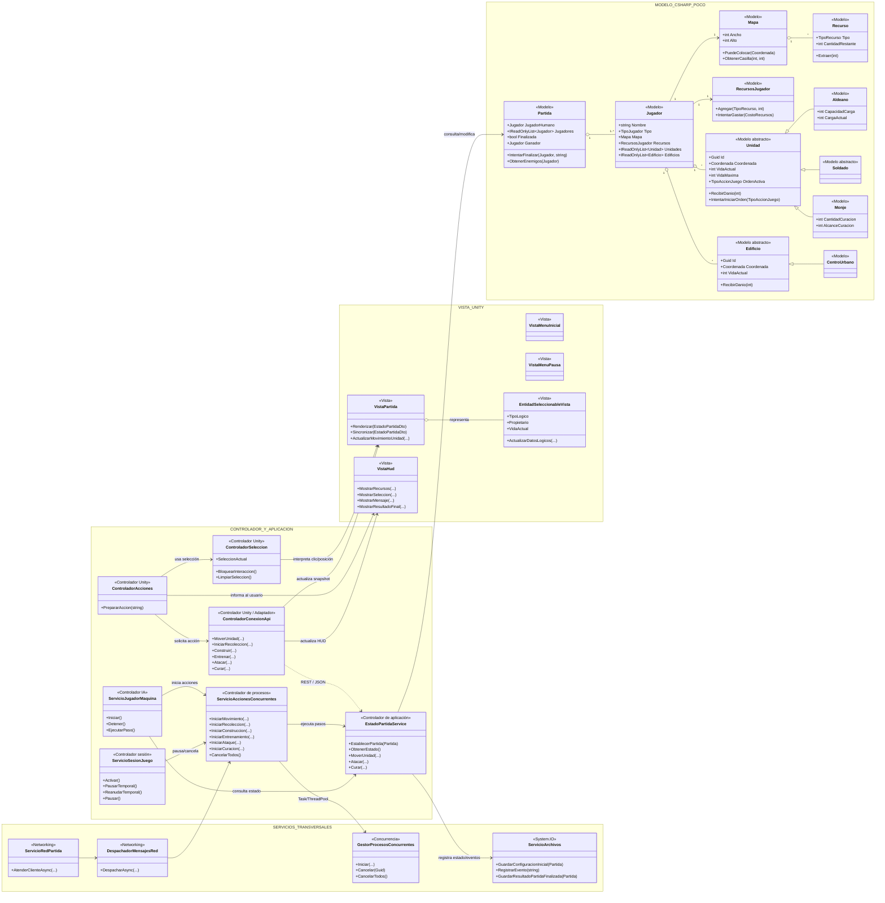
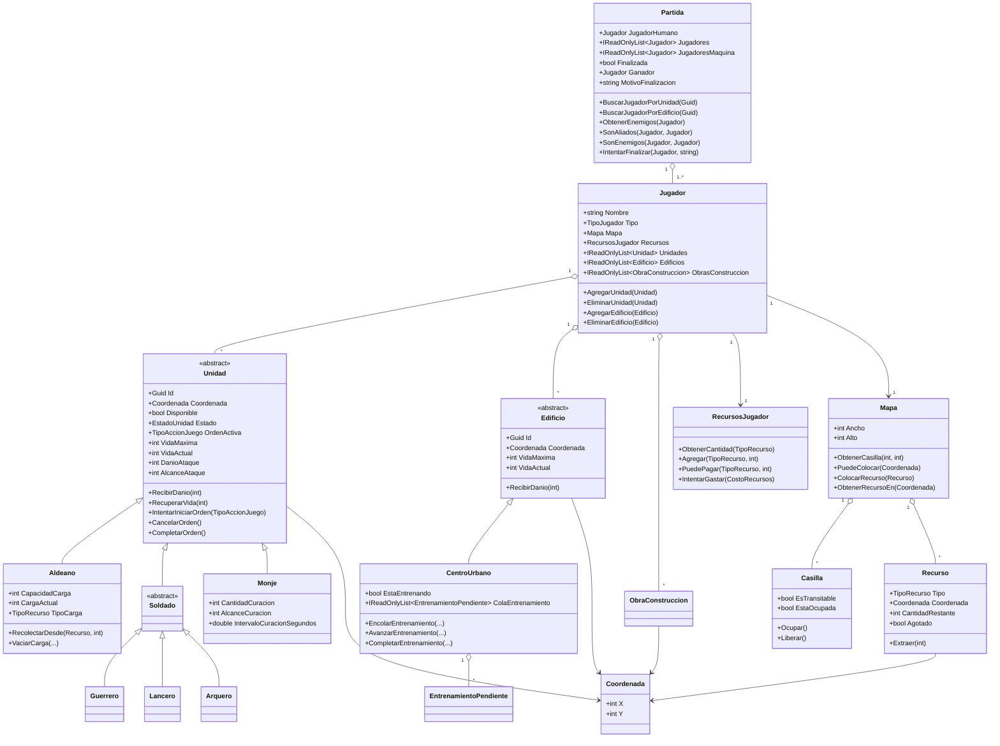

# Diagrama de Clases — Imperios en Guerra

## 1. Objetivo del diagrama

La guía del proyecto exige que el **diagrama de clases UML ilustre la arquitectura MVC y las relaciones entre las clases fundamentales**. Por eso este documento no presenta únicamente la jerarquía de unidades: primero muestra de forma explícita **Modelo, Controlador y Vista**, y después detalla el dominio principal.

### 1.1 Justificación de los elementos fundamentales

Se seleccionan estas clases y servicios porque representan el flujo esencial exigido por la guía:

- `Partida` y `Jugador`: concentran participantes, estado global y condición de finalización.
- `Mapa`, `Recurso`, `Unidad` y `Edificio`: representan el estado lógico que cambia al mover, recolectar, construir, entrenar y atacar.
- `ControladorSeleccion`, `ControladorAcciones` y `ControladorConexionApi`: reciben la interacción de Unity y coordinan las solicitudes sin trasladar reglas de negocio a la Vista.
- `VistaPartida` y `VistaHud`: representan gráficamente el estado sin decidir reglas del juego.
- `EstadoPartidaService` y `ServicioAccionesConcurrentes`: coordinan las operaciones de aplicación y el acceso sincronizado al Modelo.
- `GestorProcesosConcurrentes`: evidencia la ejecución con Task/ThreadPool y la cancelación de procesos.
- `ServicioRedPartida` y `DespachadorMensajesRed`: representan la comunicación WebSocket + JSON requerida técnicamente por la guía original.
- `ServicioArchivos`: concentra la generación de los archivos requeridos mediante `System.IO`.

La regla arquitectónica aplicada en el proyecto es:

```text
MODELO      = estado + reglas + validaciones del juego
CONTROLADOR = recibe/coordina acciones y conecta Vista con Modelo
VISTA       = Unity: escena + sprites + HUD + interacción visual
```

Regla central:

```text
C# = cerebro del juego
Unity = principalmente Vista
Controladores = puente
```

---

## 2. UML principal — Arquitectura MVC

Este es el diagrama principal de la arquitectura MVC. Los bloques muestran qué clases pertenecen a cada responsabilidad.



## Cómo leer este UML

### MODELO

El bloque **MODELO C# POCO** contiene el estado y las reglas principales.

Ejemplos:

- `Partida` decide si la partida finalizó;
- `Jugador` mantiene unidades, edificios y recursos;
- `Mapa` valida posiciones;
- `RecursosJugador` controla saldos y gastos;
- `Unidad` y `Edificio` contienen vida y estado.

Estas clases no necesitan `GameObject`, `Transform`, sprites ni otros objetos de `UnityEngine`.

### VISTA

El bloque **VISTA UNITY** representa gráficamente el estado.

Ejemplos:

- `VistaPartida` dibuja/sincroniza mapa, unidades, edificios y recursos;
- `VistaHud` muestra recursos, selección y resultados;
- `VistaMenuInicial` y `VistaMenuPausa` manejan presentación de menús;
- `EntidadSeleccionableVista` representa visualmente una entidad lógica.

La Vista no decide costos, daño, victoria ni reglas de ocupación.

### CONTROLADOR

El bloque **CONTROLADOR Y APLICACIÓN** es el puente.

Ejemplo de movimiento:

```text
clic del jugador
→ ControladorSeleccion
→ ControladorAcciones
→ ControladorConexionApi
→ API / EstadoPartidaService
→ Modelo valida y modifica
→ snapshot de respuesta
→ VistaPartida actualiza gráficos
```

Por eso el Controlador está entre Vista y Modelo y no reemplaza a ninguno de los dos.

### SERVICIOS TRANSVERSALES

No todo encaja estrictamente como entidad MVC. El proyecto también tiene servicios técnicos:

- `GestorProcesosConcurrentes`: ejecución concurrente;
- `ServicioArchivos`: `System.IO`;
- `ServicioRedPartida`: comunicación WebSocket + JSON;
- `DespachadorMensajesRed`: JSON/red.

Estos apoyan al Controlador y al Modelo sin convertir la Vista en responsable de lógica del juego.

---

## 3. UML del dominio del Modelo

Este segundo diagrama muestra con más detalle la parte de POO del Modelo.



---

## 4. Dependencias permitidas en MVC

La arquitectura del proyecto puede resumirse así:

```text
┌──────────────────────────────┐
│          VISTA UNITY         │
│ sprites · HUD · menús · mapa │
└──────────────┬───────────────┘
               │ eventos / datos visuales
               ▼
┌──────────────────────────────┐
│         CONTROLADOR          │
│ entrada · API · coordinación │
│ concurrencia · IA · sesión   │
└──────────────┬───────────────┘
               │ solicita reglas/operaciones
               ▼
┌──────────────────────────────┐
│            MODELO            │
│ estado · reglas · validación │
│ mapa · unidades · victoria   │
└──────────────────────────────┘
```

Dependencias que se evitan:

```text
MODELO  ─X→ UnityEngine
VISTA   ─X→ modificar directamente reglas internas
WORKER  ─X→ GameObject / Transform / SpriteRenderer
```

Comunicación esperada de un worker:

```text
Task / ThreadPool
→ Modelo C#
→ resultado/estado thread-safe
→ API
→ Main Thread de Unity
→ Vista
```

---

## 5. Correspondencia con carpetas reales

| Capa | Ubicación principal | Clases representativas | Responsabilidad |
|---|---|---|---|
| **Modelo** | `src/ImperiosEnGuerra.Modelo/` | `Partida`, `Jugador`, `Mapa`, `Unidad`, `Recurso`, `Edificio` | Estado, reglas y validaciones |
| **Controlador Unity** | `Assets/Scripts/Controladores/` | `ControladorSeleccion`, `ControladorAcciones`, `ControladorConexionApi` | Recibir interacción y coordinar |
| **Controlador/aplicación** | API + servicios | `EstadoPartidaService`, `ServicioAccionesConcurrentes`, `ServicioJugadorMaquina`, `ServicioSesionJuego` | Ejecutar casos de uso sobre el Modelo |
| **Vista** | `Assets/Scripts/Vistas/` | `VistaPartida`, `VistaHud`, `VistaMenuInicial`, `VistaMenuPausa` | Representación gráfica |
| **Servicios transversales** | Servicios/API | `GestorProcesosConcurrentes`, `ServicioArchivos`, `ServicioRedPartida` | Concurrencia, IO y networking |

---

## 6. Ejemplo MVC real: atacar

```text
1. VISTA
   El jugador ve y selecciona un Guerrero.

2. CONTROLADOR
   ControladorSeleccion conserva la selección.
   ControladorAcciones prepara "Atacar".
   ControladorConexionApi envía la intención.

3. CONTROLADOR / APLICACIÓN
   ServicioAccionesConcurrentes inicia el worker.
   EstadoPartidaService coordina la modificación.

4. MODELO
   El Modelo valida propietario, objetivo, alcance y vida.
   Se aplica daño y, si corresponde, se elimina la entidad.
   Se evalúa la condición de victoria.

5. VISTA
   Unity recibe el nuevo snapshot.
   VistaPartida actualiza vida/sprite.
   VistaHud actualiza estado o pantalla final.
```

Este ejemplo deja visible que **Unity no decide el daño ni la victoria** y que **el Modelo no dibuja sprites ni manipula GameObjects**.

---
