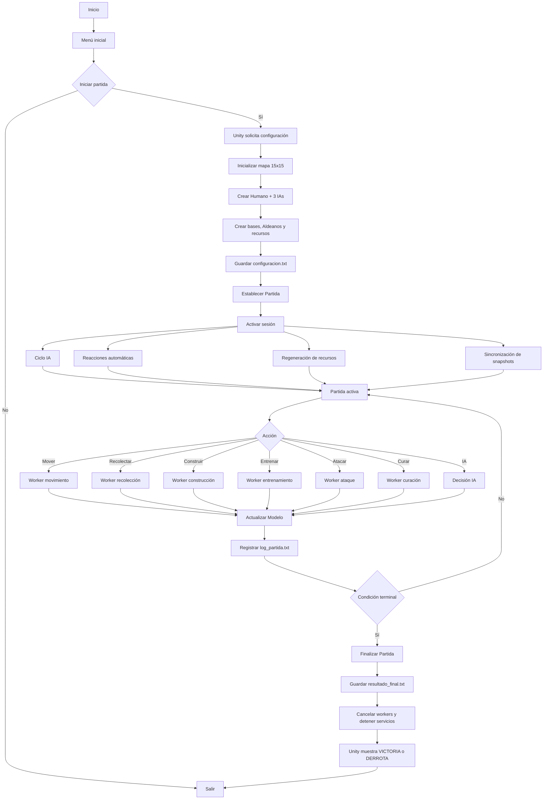
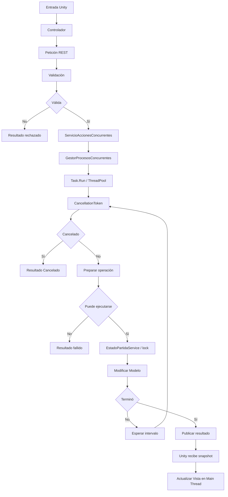
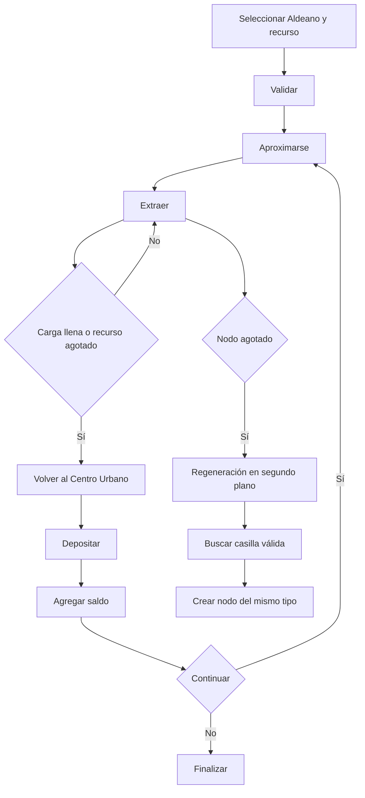
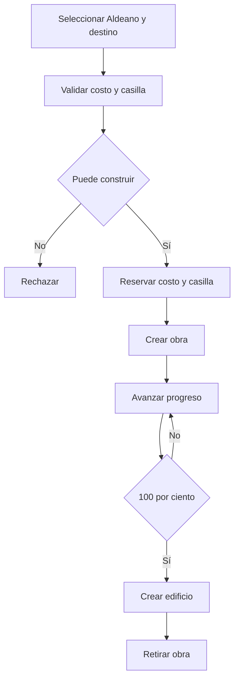
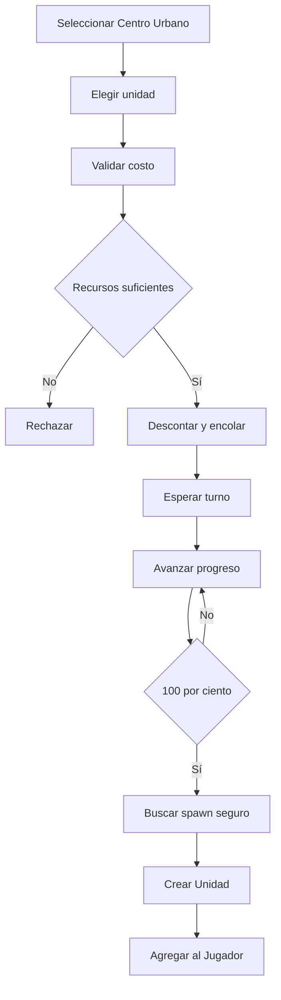
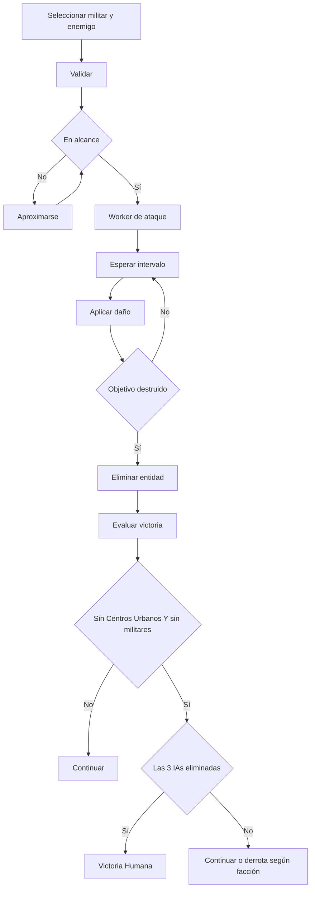
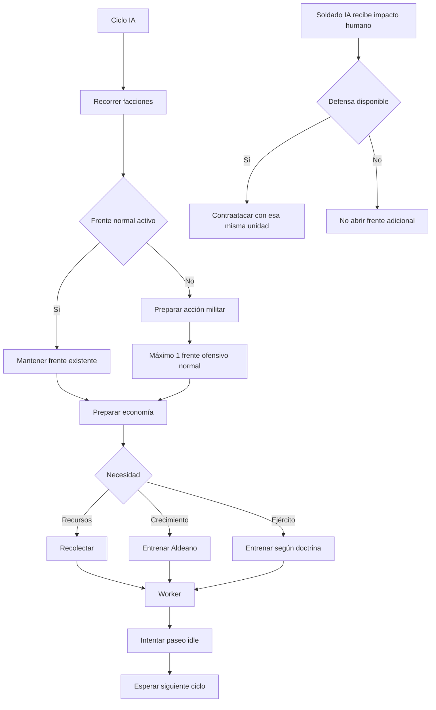
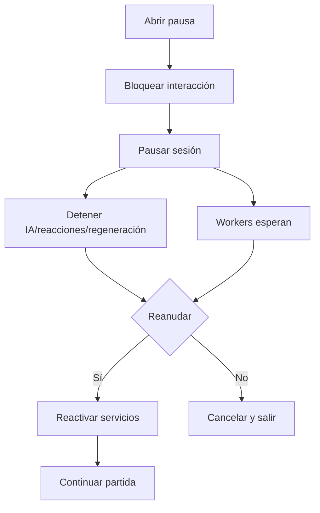

# Diagrama de Flujo — Imperios en Guerra

## 1. Flujo general de la partida



## 2. Flujo de una acción concurrente



## 3. Recolección



## 4. Construcción



## 5. Entrenamiento



## 6. Combate y victoria



## 7. IA



## 8. Pausa



## 9. Relación MVC + concurrencia

```text
Vista Unity
    ↓
Controlador
    ↓
API / Servicios
    ↓
Task.Run / ThreadPool
    ↓
Modelo C# sincronizado
    ↓
resultado thread-safe
    ↓
API / snapshot
    ↓
Controlador Unity
    ↓
Vista Unity
```
