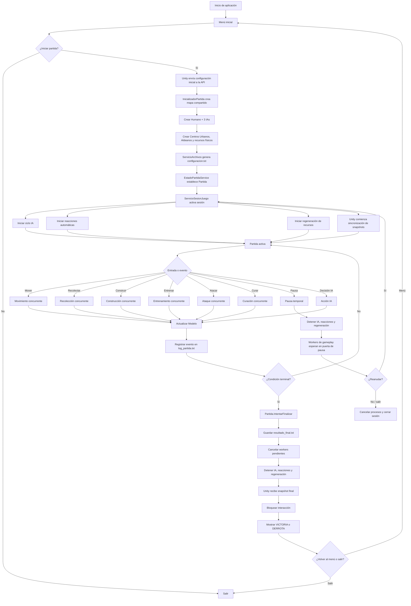
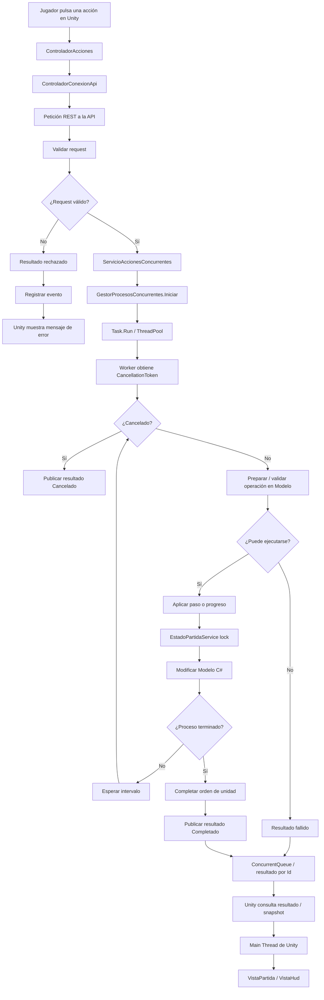
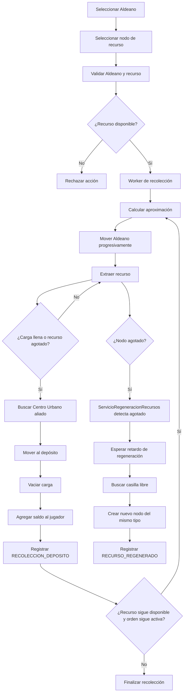
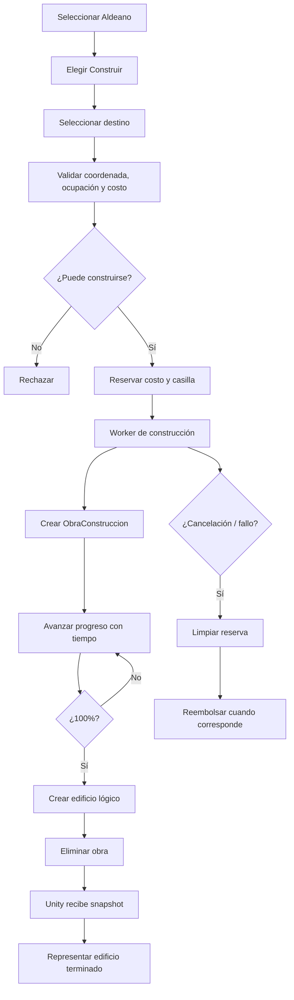
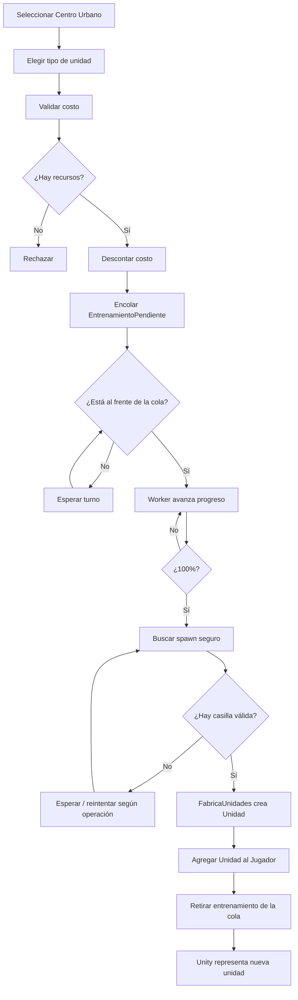
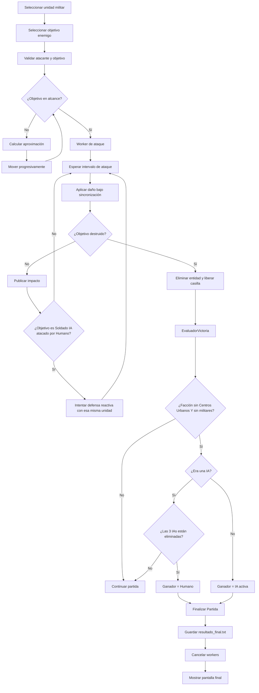
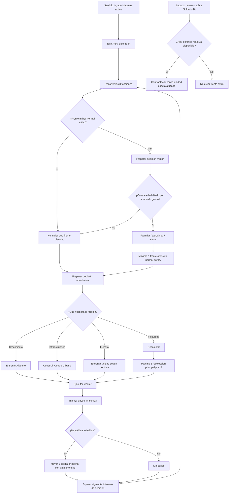
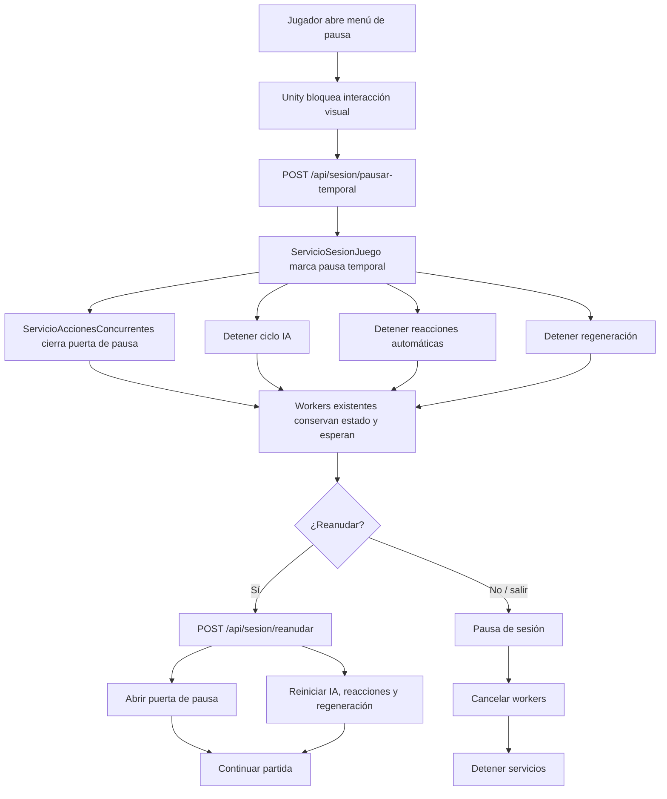

# Diagrama de flujo final — Imperios en Guerra

Este documento representa el flujo real de la versión final del proyecto. Se separan el flujo general de la partida, el flujo de una acción concurrente y el ciclo de las IAs para hacer visible la arquitectura MVC y la concurrencia.

## 1. Flujo general de la partida



## 2. Flujo de una acción concurrente

Este flujo aplica al patrón general usado por movimiento, recolección, construcción, entrenamiento, ataque y curación.



### Punto clave

El worker secundario nunca modifica directamente:

```text
GameObject
Transform
SpriteRenderer
Canvas
Text
Button
u otro objeto UnityEngine
```

La modificación gráfica ocurre cuando Unity recibe el resultado o el snapshot y lo representa en su Main Thread.

## 3. Flujo de recolección



## 4. Flujo de construcción



## 5. Flujo de entrenamiento



## 6. Flujo de combate y victoria



## 7. Ciclo de decisión de cada IA



## 8. Flujo de pausa



## 9. Relación con MVC y concurrencia

El flujo general puede resumirse como:

```text
Vista Unity
    ↓ entrada
Controlador
    ↓ request
API / Servicios
    ↓
Task.Run / ThreadPool
    ↓
Modelo C# protegido con sincronización
    ↓
resultado thread-safe
    ↓
API / snapshot
    ↓
Controlador Unity
    ↓
Vista Unity
```

Esto demuestra que:

1. la lógica del juego permanece en C#;
2. Unity actúa principalmente como Vista;
3. los controladores sirven de puente;
4. las operaciones largas se ejecutan de forma concurrente;
5. los datos compartidos están sincronizados;
6. los workers no modifican UnityEngine;
7. la partida puede cancelar o pausar procesos sin bloquear la interfaz.
