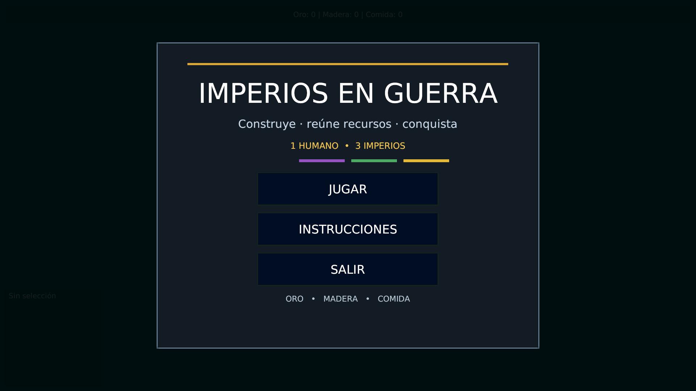
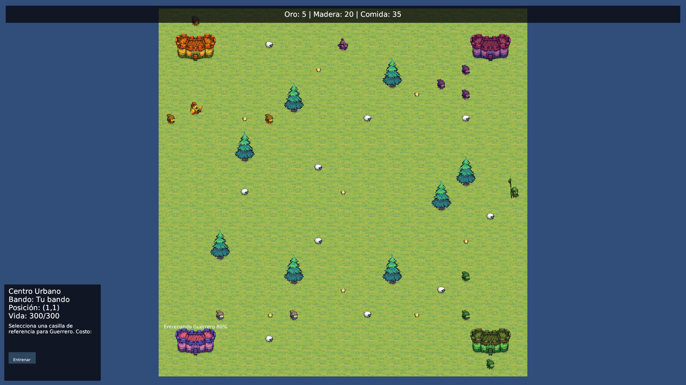
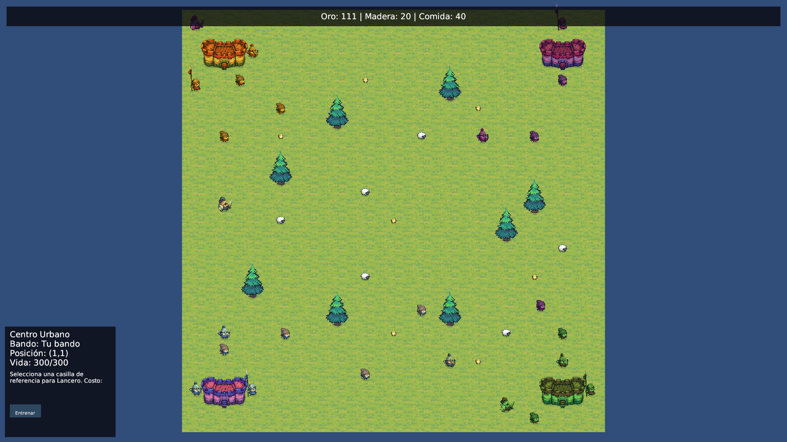
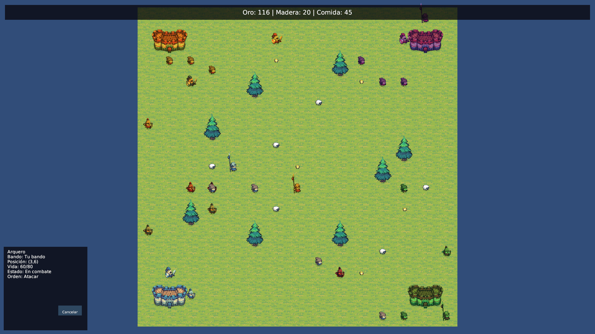

# Informe Técnico: MVC, Concurrencia y Comunicación en Red — Imperios en Guerra

## 1. Descripción general

Este informe responde al entregable técnico solicitado en la guía del proyecto: explicar de manera breve y formal cómo se aplicaron **MVC, concurrencia y comunicación en red** en *Imperios en Guerra*.

**Imperios en Guerra** es un RTS académico de escritorio desarrollado con **C# y Unity**, inspirado en Age of Empires. La modalidad final evaluada es **1 jugador Humano contra 3 facciones controladas por IA**: Morada, Verde y Amarilla.

La guía original contemplaba dos jugadores conectados entre dos instancias. Posteriormente, según la aclaración recibida por el equipo, ese punto dejó de ser obligatorio para la entrega. El proyecto conserva **WebSocket + JSON** como extensión técnica opcional y utiliza una API REST local como puente entre Unity y el núcleo lógico.

### Evidencia visual del ejecutable



**Figura 1.** Menú principal de *Imperios en Guerra*, aplicación de escritorio desarrollada en Unity.


## 2. Arquitectura MVC

### 2.1 Modelo

El Modelo se encuentra principalmente en:

```text
src/ImperiosEnGuerra.Modelo/
```

Contiene estado y reglas del juego sin depender de Unity. Entre sus clases principales se encuentran:

- `Partida`;
- `Jugador`;
- `Mapa`;
- `Casilla`;
- `Coordenada`;
- `Recurso`;
- `RecursosJugador`;
- `Unidad`;
- `Aldeano`;
- `Soldado`;
- `Guerrero`;
- `Lancero`;
- `Arquero`;
- `Monje`;
- `Edificio`;
- `CentroUrbano`.

El proyecto del Modelo usa `netstandard2.1` y no referencia `UnityEngine`.

Responsabilidades del Modelo:

- reglas de recursos;
- costos;
- estados de unidades;
- posiciones lógicas;
- vida y daño;
- validación de acciones;
- condición de victoria;
- ocupación del mapa;
- pathfinding;
- reglas de aliados/enemigos;
- decisiones lógicas de IA.

### 2.2 Vista

La Vista se encuentra principalmente en:

```text
Assets/Scripts/Vistas/
```

Clases relevantes:

- `VistaPartida`;
- `VistaHud`;
- `VistaMenuInicial`;
- `VistaMenuPausa`;
- `EntidadSeleccionableVista`;
- `AnimacionRecursoRecoleccion`.

Unity se utiliza para sprites, escena, HUD, cámara, selección, colliders/raycasts, animaciones, menús, feedback de vida crítica y representación gráfica del estado recibido desde la API.

La Vista no contiene las reglas económicas o de combate principales.




**Figura 2.** Partida en ejecución con mapa, recursos, edificios, unidades y HUD representados mediante Unity.


### 2.3 Controladores

Los controladores se encuentran en:

```text
Assets/Scripts/Controladores/
```

Entre ellos:

- `ControladorSeleccion`;
- `ControladorAcciones`;
- `ControladorMenuInicial`;
- `ControladorConexionApi`.

Flujo general:

```text
Jugador
  ↓
Unity / Controlador
  ↓
API REST
  ↓
Servicios
  ↓
Modelo C#
  ↓
resultado / snapshot
  ↓
Controlador Unity
  ↓
Vista
```

## 3. Concurrencia

La concurrencia es real y no depende exclusivamente de Coroutines.

El componente base es:

```text
GestorProcesosConcurrentes
```

Utiliza `Task.Run`, por lo que los trabajos se ejecutan mediante hilos del ThreadPool.

Mantiene:

- procesos activos;
- `CancellationTokenSource`;
- resultados concurrentes;
- identificadores de proceso;
- identificador del hilo que ejecutó el trabajo.

### Operaciones concurrentes principales

`ServicioAccionesConcurrentes` ejecuta:

- movimiento;
- recolección;
- construcción;
- entrenamiento;
- ataque;
- curación;
- movimientos idle de IA.

Además existen tareas independientes para:

- ciclo de decisiones de las IAs;
- reacciones automáticas;
- regeneración de recursos;
- monitor de sesión;
- listener WebSocket opcional.



**Figura 3.** Ejecución simultánea de distintas actividades de gameplay. Varias entidades pueden mantener procesos independientes sin bloquear la interfaz principal.


## 4. Sincronización y condiciones de carrera

### 4.1 Dos procesos gastando los mismos recursos

Dos workers podrían comprobar simultáneamente que existe saldo suficiente y descontar el mismo dinero dos veces.

`RecursosJugador` usa `lock` y realiza validación y descuento dentro de una misma sección crítica.

### 4.2 Estado global de la partida

`EstadoPartidaService` centraliza operaciones sobre la partida activa y protege el acceso con sincronización.

### 4.3 Procesos concurrentes por unidad

`ServicioAccionesConcurrentes` utiliza `ConcurrentDictionary` para asociar unidades con procesos activos y evitar órdenes incompatibles sobre la misma unidad.

### 4.4 Resultados de workers

`GestorProcesosConcurrentes` utiliza:

- `ConcurrentDictionary`;
- `ConcurrentQueue`;
- `Interlocked`.

### 4.5 Networking

`ServicioRedPartida` mantiene conexiones concurrentes y usa `SemaphoreSlim` para serializar envíos por WebSocket.

## 5. Cancelación

Los procesos utilizan `CancellationToken`.

Casos:

- cancelar una orden;
- cancelar procesos al finalizar la partida;
- detener servicios al salir;
- pausar/reanudar servicios de sesión;
- terminar un worker cuando su unidad deja de ser válida.

## 6. Comunicación segura con el Main Thread de Unity

Los workers no modifican directamente objetos de Unity.

```text
Task / worker
   ↓
Modelo C#
   ↓
EstadoPartidaService
   ↓
API / respuesta
   ↓
Unity recibe snapshot
   ↓
VistaPartida / VistaHud en Main Thread
```

Unity utiliza Coroutines para peticiones HTTP y actualización visual, pero no sustituyen los workers de C# exigidos para la concurrencia del gameplay.



**Figura 4.** El HUD refleja el estado de una unidad durante la ejecución de una acción, mientras la actualización gráfica permanece bajo responsabilidad del Main Thread de Unity.


## 7. Comunicación en red

La guía original exige comunicación en red. El alcance final comunicado al equipo dejó de requerir dos clientes Unity enfrentados, pero la implementación **WebSocket + JSON** se conserva en el código y se prueba como parte técnica del proyecto.

El endpoint de red es:

```text
/ws/partida
```

Mensajes JSON:

- `MOVER`;
- `RECOLECTAR`;
- `CONSTRUIR`;
- `ENTRENAR`;
- `ATACAR`;
- `CURAR`.

La escucha se ejecuta de forma asíncrona mediante `ServicioRedPartida.AtenderClienteAsync(...)`, por lo que no bloquea el hilo principal de Unity. Las conexiones se almacenan en `ConcurrentDictionary`; cada conexión utiliza `SemaphoreSlim` para serializar sus envíos. Los mensajes son deserializados por `DespachadorMensajesRed` y se transforman en las mismas operaciones concurrentes utilizadas por el resto del gameplay.

Formato lógico del mensaje:

```text
Tipo + EmisorId + MensajeId + Datos(JSON)
```

El servicio acepta acciones `MOVER`, `RECOLECTAR`, `CONSTRUIR`, `ENTRENAR`, `ATACAR` y `CURAR`. JSON inválido, mensajes vacíos o tipos no soportados se rechazan de forma controlada. El cierre de conexión, la cancelación y los errores `WebSocketException` se manejan sin bloquear ni finalizar inesperadamente la aplicación.


**Figura 5.** Evidencia de la implementación y validación de comunicación mediante WebSocket y mensajes JSON.


## 8. Evidencia de pruebas

La suite .NET cubre Modelo, economía, recolección, movimiento, A*, construcción, entrenamiento, sincronización, ataque, victoria, IA, networking, archivos, cancelación y regeneración.

Última ejecución validada:

```text
Total: 390
Correctas: 390
Errores: 0
Omitidas: 0
```


**Figura 6.** Ejecución final de la suite automatizada con 390 pruebas correctas, 0 errores y 0 omitidas.


Las advertencias de acceso denegado a `log_partida.txt` corresponden a una prueba intencional de manejo de IO.

El build Windows standalone fue generado y ejecutado correctamente. El launcher inicia la API, abre el juego y detiene la API cuando el juego se cierra.

## 9. Conclusión

El proyecto separa el cerebro del juego de su representación gráfica. Las reglas residen en C# y los procesos largos se ejecutan con concurrencia real, mientras Unity se mantiene principalmente como Vista e interfaz.

La solución evidencia la separación MVC exigida, concurrencia real con `Task`/ThreadPool y sincronización de datos compartidos, comunicación segura con el Main Thread de Unity y una implementación de red WebSocket + JSON no bloqueante. Estos tres ejes están respaldados por pruebas automatizadas y por los diagramas y pruebas de escritorio incluidos como entregables.
