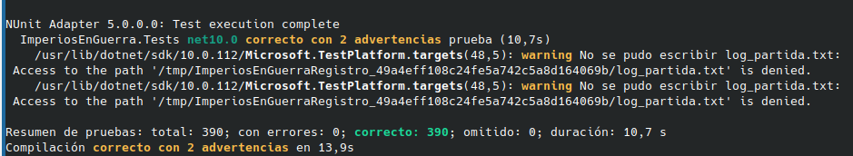
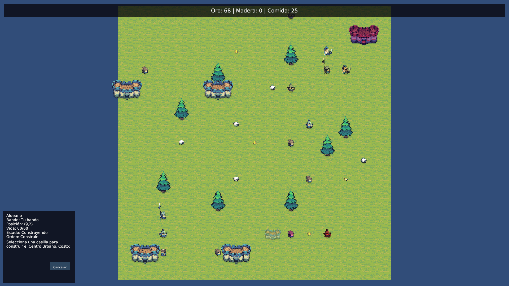
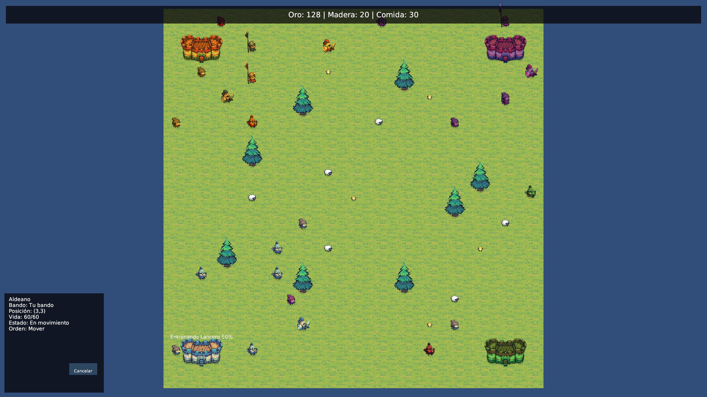
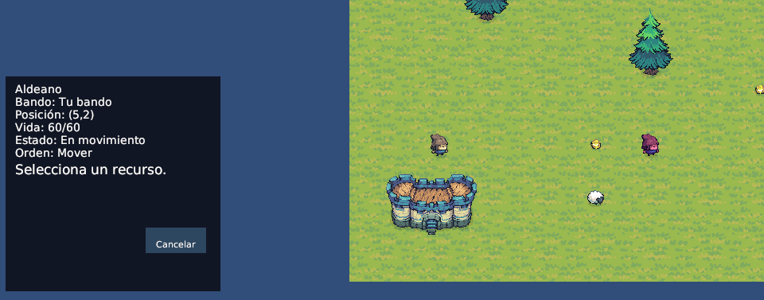
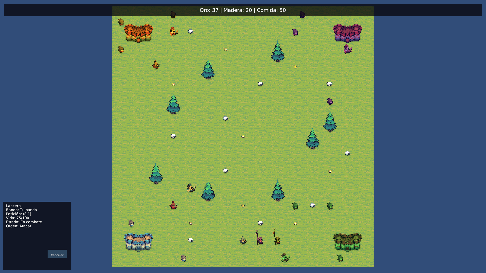
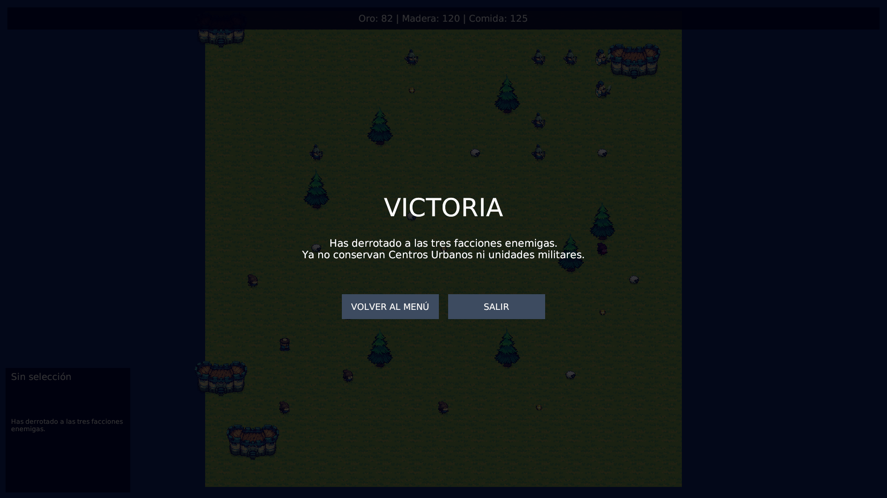
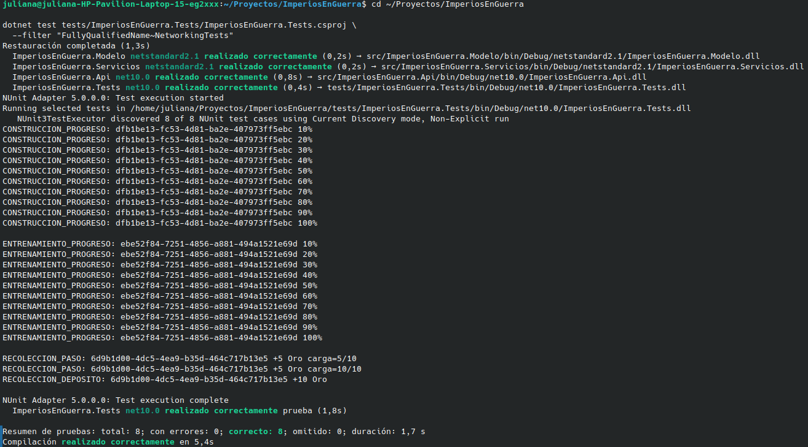
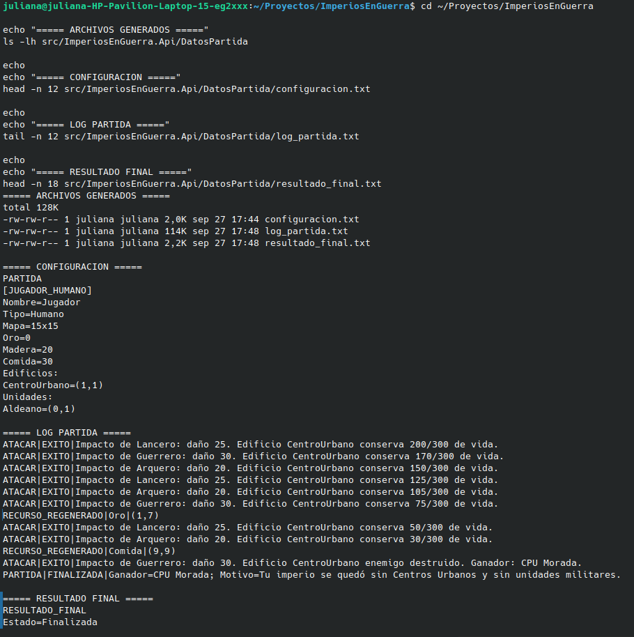

# Pruebas de Escritorio — Imperios en Guerra

## 1. Objetivo

Este documento formaliza pruebas de escritorio sobre las secciones críticas señaladas por la guía: **concurrencia, comunicación en red, ataques y condición de victoria**. Se incluyen además algunos casos de apoyo necesarios para comprobar el flujo completo.

Evidencia automatizada validada:

```text
Total: 390
Correctas: 390
Errores: 0
Omitidas: 0
```



**Figura 1.** Ejecución de la suite automatizada con 390 pruebas correctas, 0 errores y 0 omitidas.


## 2. Matriz de casos

| ID | Caso | Tipo | Resultado esperado | Evidencia |
|---|---|---|---|---|
| PE-01 | Movimiento válido | Normal / concurrente | La unidad llega al destino progresivamente y libera su orden | Tests de movimiento concurrente y A* |
| PE-02 | Movimiento inválido | Inválido | Se rechaza sin modificar coordenadas | Tests de solicitudes inválidas |
| PE-03 | Cancelación de movimiento | Concurrente | Worker cancelado y unidad liberada | Tests de cancelación |
| PE-04 | Recolección con depósito | Normal / concurrente | Extrae, carga, vuelve al Centro Urbano y deposita | Tests de ciclo de recolección |
| PE-05 | Cancelar recolección | Concurrente | No pierde carga válida y vuelve a estado disponible | Tests de cancelación/recolección |
| PE-06 | Regenerar recurso agotado | Concurrente | Aparece nodo del mismo tipo en casilla válida | Tests de regeneración |
| PE-07 | Construcción válida | Normal / concurrente | Obra progresa y genera un edificio | Tests de construcción |
| PE-08 | Dos construcciones misma casilla | Race condition | Solo una obtiene la reserva | Tests de conflicto de construcción |
| PE-09 | Cancelar construcción | Concurrente | No queda edificio/casilla fantasma | Tests de cancelación |
| PE-10 | Entrenamiento en cola | Normal / concurrente | Respeta cola, costo y spawn seguro | Tests de entrenamiento |
| PE-11 | Gasto económico concurrente | Race condition | Solo una operación gana si el saldo alcanza para una | Tests de economía atómica |
| PE-12 | Operaciones distintas simultáneas | Concurrente | Pueden coexistir sin bloquear globalmente la partida | Tests de operaciones simultáneas |
| PE-13 | Ataque progresivo | Normal / concurrente | Reduce vida por intervalos hasta destruir | Tests de ataque concurrente |
| PE-14 | Cancelar ataque antes del impacto | Concurrente | No reduce vida | Tests de cancelación |
| PE-15 | Defensa reactiva IA | IA / concurrente | Responde la unidad exacta atacada, no las vecinas | `DefensaReactivaIaTests` |
| PE-16 | Paseo idle solo IA | IA | IA puede pasear; Aldeano humano queda quieto | Tests de paseo/reacción |
| PE-17 | Regla de victoria AND | Límite | Solo elimina facción sin CU y sin militares | `VictoriaFinalTests` |
| PE-18 | Finalización cancela workers | Concurrente | Se finaliza partida y se cancelan procesos pendientes | Tests de finalización |
| PE-19 | Archivos obligatorios | IO | Se generan configuración, log y resultado final | `ServicioArchivosTests` |
| PE-20 | Mensaje WebSocket válido | Red / integración | JSON válido se transforma en una acción concurrente y devuelve `ProcesoId` | `NetworkingTests` |
| PE-21 | Mensaje de red inválido | Red / inválido | JSON mal formado o tipo desconocido se rechaza sin lanzar excepción ni crear proceso | `NetworkingTests` |


## 3. Casos de escritorio detallados

### PE-08 — Race condition de construcción

Estado inicial:

```text
Casilla X libre
Task A intenta construir en X
Task B intenta construir en X
```

Riesgo sin sincronización:

```text
A valida X libre
B valida X libre
A reserva X
B reserva X
=> dos construcciones superpuestas
```

Resultado requerido:

```text
Solo una operación obtiene la reserva.
La otra se rechaza.
No se duplican edificios.
```



**Figura 2.** Evidencia visual de una construcción en progreso dentro de la partida.




**Figura 3.** Ejecución simultánea de distintas operaciones de gameplay, correspondiente al caso PE-12.


### PE-11 — Gasto concurrente

Estado inicial:

```text
Saldo suficiente para una sola compra
Dos tareas intentan gastar simultáneamente
```

Riesgo:

```text
A lee saldo suficiente
B lee saldo suficiente
A descuenta
B descuenta
=> doble gasto
```

Solución:

`RecursosJugador.IntentarGastar(...)` protege comprobación y descuento con `lock`.

Resultado:

```text
Una operación tiene éxito.
La otra falla.
El saldo nunca queda negativo.
```

### PE-15 — Defensa reactiva

Estado inicial:

```text
Una IA puede tener un frente ofensivo normal.
El Humano golpea otro Soldado IA.
```

Resultado:

```text
La unidad exacta atacada puede contraatacar.
No se unen unidades cercanas.
No se duplican defensas de la misma facción.
```



**Figura 4.** Aldeano ejecutando una tarea de recolección de recursos, correspondiente al ciclo concurrente descrito en PE-04.


### PE-13 — Ataque concurrente

Estado inicial:

```text
Unidad militar atacante disponible
Objetivo enemigo existente y con vida
```

Secuencia:

```text
validar atacante y objetivo
→ aproximar si está fuera de alcance
→ iniciar worker de ataque
→ esperar intervalo
→ aplicar daño
→ repetir mientras el objetivo siga vivo
```

Resultado esperado:

```text
La vida disminuye según las reglas del Modelo.
La entidad solo se elimina al llegar a 0 de vida.
La casilla se libera al destruirse el objetivo.
La Vista se actualiza a partir del nuevo estado.
```



**Figura 5.** Combate en ejecución con actualización progresiva de vida y acciones concurrentes.


### PE-17 — Regla AND

```text
Caso A:
CU existe
militares = 0
=> no termina

Caso B:
CU = 0
militares existen
=> no termina

Caso C:
CU = 0
militares = 0
=> facción eliminada
```



**Figura 6.** Pantalla de finalización de partida tras cumplirse la condición de victoria o derrota.


### PE-20 / PE-21 — Comunicación WebSocket + JSON

Mensaje válido de ejemplo:

```json
{
  "tipo": "MOVER",
  "emisorId": "instancia-prueba",
  "mensajeId": "<guid>",
  "datos": {
    "unidadId": "<guid>",
    "destino": { "x": 2, "y": 0 }
  }
}
```

Resultado esperado para un mensaje válido:

```text
ServicioRedPartida recibe texto
→ DespachadorMensajesRed deserializa JSON
→ se valida Tipo y Datos
→ ServicioAccionesConcurrentes inicia la acción
→ se devuelve ResultadoDespachoRed con Exito=true y ProcesoId
```

Caso inválido:

```text
JSON mal formado o Tipo desconocido
→ Exito=false
→ ProcesoId=null
→ no se lanza una excepción al consumidor
→ no se inicia ninguna acción de gameplay
```

La suite `NetworkingTests` cubre mensajes para MOVER, RECOLECTAR, CONSTRUIR, ENTRENAR, ATACAR y CURAR, además del rechazo de JSON/tipos inválidos.



**Figura 7.** Evidencia de la disponibilidad del endpoint WebSocket y de las pruebas de comunicación mediante JSON.

### PE-19 — Archivos obligatorios

Los archivos requeridos son generados mediante `ServicioArchivos` y almacenados durante la ejecución de la partida.



**Figura 8.** Evidencia de `configuracion.txt`, `log_partida.txt` y `resultado_final.txt` generados por la aplicación.


## 4. Correspondencia con las secciones críticas de la guía

| Sección crítica | Casos de escritorio | Evidencia principal |
|---|---|---|
| Concurrencia y sincronización | PE-03, PE-05, PE-08, PE-11, PE-12, PE-18 | pruebas de cancelación, conflictos, gasto atómico y operaciones simultáneas |
| Comunicación en red | PE-20, PE-21 | `NetworkingTests`, `ServicioRedPartida`, `DespachadorMensajesRed` |
| Ataques | PE-13, PE-14, PE-15 | pruebas de ataque concurrente, cancelación y defensa reactiva |
| Condición de victoria | PE-17, PE-18 | `VictoriaFinalTests` y pruebas de finalización/cancelación |

## 5. Conclusión

La suite automatizada cubre casos normales, inválidos, límite y concurrentes. Los riesgos principales de concurrencia se abordan mediante `lock`, `ConcurrentDictionary`, `ConcurrentQueue`, `Interlocked`, `SemaphoreSlim` y `CancellationToken`.

La cobertura documental queda alineada con las cuatro áreas críticas exigidas: concurrencia, red, ataques y condición de victoria. Las pruebas automatizadas citadas sirven como evidencia adicional de que los escenarios descritos corresponden al comportamiento implementado.
