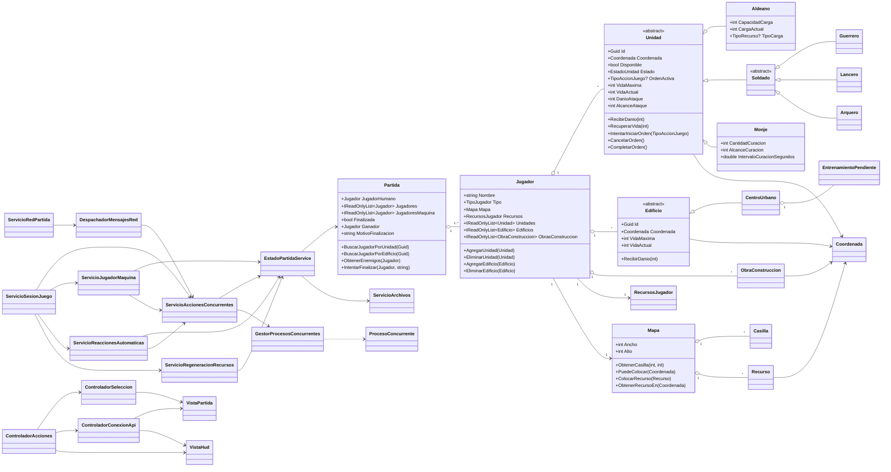

# UML final — Imperios en Guerra

Este diagrama resume las clases y relaciones principales del código final. Se omiten DTOs y clases de resultado menores para mantener legible el modelo.

## Lectura del diagrama

`Partida` es el agregado principal. Cada `Jugador` contiene unidades, edificios, obras, recursos económicos y referencia al mapa lógico.

`Unidad` concentra identidad, posición, disponibilidad, orden activa, vida y estadísticas. `Aldeano`, `Soldado` y `Monje` especializan ese comportamiento.

`EstadoPartidaService` centraliza el acceso sincronizado a la partida activa. `ServicioAccionesConcurrentes` crea procesos de gameplay y delega en `GestorProcesosConcurrentes`.

Unity consume DTOs de la API y mantiene la separación entre Controladores y Vistas, sin que los workers secundarios modifiquen directamente `UnityEngine`.
