# UML final — Imperios en Guerra

Este diagrama representa las clases y relaciones principales del código final. Se omiten DTOs y clases de resultado menores para mantener legible el modelo.

## Diagrama de clases

```mermaid
classDiagram
direction LR

class Partida {
  +Jugador JugadorHumano
  +Jugador JugadorMaquina
  +IReadOnlyList~Jugador~ Jugadores
  +IReadOnlyList~Jugador~ JugadoresMaquina
  +bool Finalizada
  +Jugador Ganador
  +string MotivoFinalizacion
  +BuscarJugadorPorUnidad(Guid)
  +BuscarJugadorPorEdificio(Guid)
  +ObtenerEnemigos(Jugador)
  +SonAliados(Jugador, Jugador)
  +SonEnemigos(Jugador, Jugador)
  +IntentarFinalizar(Jugador, string)
}

class Jugador {
  +string Nombre
  +TipoJugador Tipo
  +Mapa Mapa
  +RecursosJugador Recursos
  +IReadOnlyList~Unidad~ Unidades
  +IReadOnlyList~Edificio~ Edificios
  +IReadOnlyList~ObraConstruccion~ ObrasConstruccion
  +AgregarUnidad(Unidad)
  +EliminarUnidad(Unidad)
  +AgregarEdificio(Edificio)
  +EliminarEdificio(Edificio)
}

class Mapa {
  +int Ancho
  +int Alto
  +ObtenerCasilla(int, int)
  +PuedeColocar(Coordenada)
  +ColocarRecurso(Recurso)
  +ObtenerRecursoEn(Coordenada)
}

class Casilla {
  +bool EsTransitable
  +bool EstaOcupada
  +Ocupar()
  +Liberar()
}

class Coordenada {
  +int X
  +int Y
}

class Recurso {
  +TipoRecurso Tipo
  +Coordenada Coordenada
  +int CantidadRestante
  +bool Agotado
  +Extraer(int)
}

class RecursosJugador {
  +ObtenerCantidad(TipoRecurso)
  +Agregar(TipoRecurso, int)
  +PuedePagar(TipoRecurso, int)
  +IntentarGastar(TipoRecurso, int)
  +IntentarGastar(CostoRecursos)
}

class Unidad {
  <<abstract>>
  +Guid Id
  +Coordenada Coordenada
  +bool Disponible
  +EstadoUnidad Estado
  +TipoAccionJuego? OrdenActiva
  +int VidaMaxima
  +int VidaActual
  +int DanioAtaque
  +int AlcanceAtaque
  +RecibirDanio(int)
  +RecuperarVida(int)
  +IntentarIniciarOrden(TipoAccionJuego)
  +CancelarOrden()
  +CompletarOrden()
}

class Aldeano {
  +int CapacidadCarga
  +int CargaActual
  +TipoRecurso? TipoCarga
  +RecolectarDesde(Recurso, int)
  +VaciarCarga(out TipoRecurso)
}

class Soldado {
  <<abstract>>
}

class Guerrero
class Lancero
class Arquero

class Monje {
  +int CantidadCuracion
  +int AlcanceCuracion
  +double IntervaloCuracionSegundos
}

class Edificio {
  <<abstract>>
  +Guid Id
  +Coordenada Coordenada
  +int VidaMaxima
  +int VidaActual
  +RecibirDanio(int)
}

class CentroUrbano {
  +bool EstaEntrenando
  +string TipoUnidadEntrenando
  +IReadOnlyList~EntrenamientoPendiente~ ColaEntrenamiento
  +EncolarEntrenamiento(string, Coordenada)
  +AvanzarEntrenamiento(Guid, int)
  +CompletarEntrenamiento(Guid)
  +CancelarEntrenamiento(Guid)
}

class EntrenamientoPendiente {
  +Guid Id
  +string TipoUnidad
  +int Progreso
}

class ObraConstruccion {
  +Guid Id
  +Guid AldeanoId
  +string TipoEdificio
  +Coordenada Coordenada
  +int Progreso
  +Avanzar(int)
}

class EstadoPartidaService {
  -Partida partidaActiva
  +MoverUnidad(...)
  +PrepararMovimientoProgresivo(...)
  +AvanzarMovimiento(...)
  +Atacar(...)
  +Curar(...)
  +PrepararDecisionMaquina(...)
  +ObtenerEstado()
  +EstablecerPartida(Partida)
}

class ServicioAccionesConcurrentes {
  +IniciarMovimiento(...)
  +IniciarMovimientoIdle(...)
  +IniciarRecoleccion(...)
  +IniciarConstruccion(...)
  +IniciarEntrenamiento(...)
  +IniciarAtaque(...)
  +IniciarCuracion(...)
  +CancelarTodos()
}

class GestorProcesosConcurrentes {
  +Iniciar(string, Func)
  +Cancelar(Guid)
  +CancelarTodos()
  +IntentarObtenerResultado(...)
}

class ProcesoConcurrente {
  +Guid Id
  +string Nombre
  +Task Finalizacion
}

class ServicioJugadorMaquina {
  +Iniciar()
  +Detener()
  +EjecutarPaso()
}

class ServicioReaccionesAutomaticas {
  +Iniciar()
  +Detener()
  +EjecutarPaso()
}

class ServicioRegeneracionRecursos {
  +Iniciar()
  +Detener()
  +EjecutarPaso()
}

class ServicioSesionJuego {
  +Activar()
  +RegistrarLatido()
  +PausarTemporal()
  +ReanudarTemporal()
  +Pausar()
}

class ServicioArchivos {
  +GuardarConfiguracionInicial(Partida)
  +RegistrarEvento(string)
  +GuardarResultadoPartidaFinalizada(Partida)
}

class ServicioRedPartida {
  +AtenderClienteAsync(WebSocket, CancellationToken)
  +int ClientesConectados
}

class DespachadorMensajesRed {
  +DespacharAsync(string, CancellationToken)
}

class ControladorSeleccion {
  +BloquearInteraccion()
  +LimpiarSeleccion()
}

class ControladorAcciones {
  +PrepararAccion(string)
}

class ControladorConexionApi {
  +MoverUnidad(...)
  +IniciarRecoleccion(...)
  +Construir(...)
  +Entrenar(...)
  +Atacar(...)
  +Curar(...)
  +PausarPartidaDesdeMenu(...)
}

class VistaPartida {
  +Sincronizar(...)
  +ActualizarMovimientoUnidad(...)
}

class VistaHud {
  +MostrarRecursos(int,int,int)
  +MostrarSeleccion(...)
  +MostrarMensaje(...)
  +MostrarResultadoFinal(...)
}

Unidad <|-- Aldeano
Unidad <|-- Soldado
Unidad <|-- Monje
Soldado <|-- Guerrero
Soldado <|-- Lancero
Soldado <|-- Arquero

Edificio <|-- CentroUrbano

Partida "1" o-- "1..*" Jugador
Jugador "1" o-- "*" Unidad
Jugador "1" o-- "*" Edificio
Jugador "1" o-- "*" ObraConstruccion
Jugador "1" --> "1" RecursosJugador
Jugador "1" --> "1" Mapa

Mapa "1" o-- "*" Casilla
Mapa "1" o-- "*" Recurso
Recurso --> Coordenada
Unidad --> Coordenada
Edificio --> Coordenada
ObraConstruccion --> Coordenada

CentroUrbano "1" o-- "*" EntrenamientoPendiente

EstadoPartidaService --> Partida
EstadoPartidaService --> ServicioArchivos
ServicioAccionesConcurrentes --> EstadoPartidaService
ServicioAccionesConcurrentes --> GestorProcesosConcurrentes
GestorProcesosConcurrentes ..> ProcesoConcurrente

ServicioJugadorMaquina --> EstadoPartidaService
ServicioJugadorMaquina --> ServicioAccionesConcurrentes
ServicioReaccionesAutomaticas --> EstadoPartidaService
ServicioReaccionesAutomaticas --> ServicioAccionesConcurrentes
ServicioRegeneracionRecursos --> EstadoPartidaService
ServicioSesionJuego --> ServicioAccionesConcurrentes
ServicioSesionJuego --> ServicioJugadorMaquina
ServicioSesionJuego --> ServicioReaccionesAutomaticas
ServicioSesionJuego --> ServicioRegeneracionRecursos

ServicioRedPartida --> DespachadorMensajesRed
DespachadorMensajesRed --> ServicioAccionesConcurrentes

ControladorAcciones --> ControladorSeleccion
ControladorAcciones --> ControladorConexionApi
ControladorAcciones --> VistaHud
ControladorConexionApi --> VistaPartida
ControladorConexionApi --> VistaHud
ControladorSeleccion --> VistaPartida
```

## Lectura del diagrama

### Núcleo del Modelo

`Partida` es el agregado principal. Mantiene a los participantes y el estado terminal de la partida.

Cada `Jugador` contiene:

- unidades;
- edificios;
- obras en construcción;
- saldos económicos;
- referencia al mapa lógico.

Las IAs comparten el mismo mapa físico con el Humano en la modalidad final.

### Jerarquía de unidades

`Unidad` concentra identidad, posición, disponibilidad, orden activa, vida y estadísticas de ataque.

`Aldeano` añade capacidad y carga de recursos.

`Soldado` agrupa las unidades militares ofensivas:

- Guerrero;
- Lancero;
- Arquero.

`Monje` hereda directamente de `Unidad` porque su función final es de apoyo y curación, no de ataque.

### Edificios

`Edificio` contiene identidad, posición y vida.

`CentroUrbano` extiende el edificio y administra la cola lógica de entrenamiento.

### Servicios

`EstadoPartidaService` es el punto sincronizado de acceso a la partida activa desde la API.

`ServicioAccionesConcurrentes` crea los procesos de gameplay y delega su ejecución a `GestorProcesosConcurrentes`.

`GestorProcesosConcurrentes` encapsula `Task.Run`, cancelación y publicación thread-safe de resultados.

Los servicios de IA, reacciones y regeneración trabajan de forma independiente y solicitan modificaciones mediante el estado sincronizado.

### Unity

Las clases `Controlador*` reciben interacción y coordinan peticiones.

Las clases `Vista*` representan el estado gráfico.

Unity no mantiene una referencia directa a las clases del Modelo: consume contratos/DTOs de la API, preservando la separación MVC adoptada por el proyecto.
